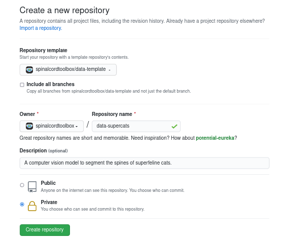

# `data-${dataset_name}`

Part of [`spinalcordtoolbox`](https://github.com/spinalcordtoolbox).


## Using the Template

1. Make a [new repo](https://github.com/new) using this as its template.

    Name it `spinalcordtoolbox/data-${dataset_name}` where `${dataset_name}` is something usefully descriptive:

    

2. Download the new repo
    
    ```bash
    git clone git@github.com:spinalcordtoolbox/data-${dataset_name}.git
    cd data-${dataset_name}
    ```
    
3. Fill with initial metadata
    
    ```bash
    # 1. Find and replace ${dataset-name} with the name you picked (e.g. `supercats`)
    perl -pi -e 's/\${dataset_name}/supercats/' README.md
    perl -pi -e 's/\${dataset_name}/supercats/' setup.py
   
    # 2. Rename the repo's `dataset` folder to match the repo name
    git mv src/spinalcordtoolbox/data/dataset src/spinalcordtoolbox/data/${dataset_name}
   
    # 3. Commit the changes 
    git add -u
    git commit -m "Setting data-${dataset_name} package metadata"
    git push
    ```
    
4. Fill with initial data and upload
    
    ```bash
    # 1. Copy over the data files to the dataset folder in this repo
    cp ${data_files} src/spinalcordtoolbox/data/${dataset_name}
   
    # 2. Add, commit, and push the newly-added files
    git add .
    git commit -m "Copy over data files to dataset folder"
    git push
    ```

5. Remove the "Using this template" section from `README.md`, since it is now no longer needed.

    ```bash
    # Delete the 'Using the Template' section from `README.md`
    vi README.md
   
    # Add, commit, and push the changes
    git add README.md
    git commit -m "Removing template section from README.md"
    git push
    ```


## How to update this dataset

1. Edit and commit the files in `src/spinalcordtoolbox/data/`
2. Go to https://github.com/spinalcordtoolbox/data-${dataset_name}/releases
3. Click "Draft Release"
4. Fill in a version tag. We recommend using date-based releases (e.g. `2020.1.1`, `2022.5.18`, etc.). 

   **Note**: The version must be formatted in a way that complies with [PEP 440](https://peps.python.org/pep-0440/). The easiest way to do this is to use a numerical version number in the form of X.Y.Z, but there is [some flexibility](https://peps.python.org/pep-0440/#final-releases) here.

5. Click "Publish Release"
6. Wait a few minutes;
7. Monitor the progress at https://github.com/spinalcordtoolbox/data-${dataset_name}/actions/workflows/release.yml
8. The release should appear on https://github.com/spinalcordtoolbox/data-${dataset_name}/releases
   with the .tar.gz (sdist) and .whl (wheel) formats attached momentarily.


## How to test this repo locally

If you've encountered an error during the GitHub Actions workflow, you can use the following steps to test the repo locally:

```bash
# Create a virtual environment
python -m venv venv
source venv/bin/activate

# Install the `build` package (which is necessary to build pip packages)
pip install build

# Build the pip package, which will generate:
#   1. A build folder (containing a copy of the files to be packaged)
#   2. A packaged wheel (stored in ./dist/${package-name}.whl)
#   3. A packaged source distribution (stored in ./dist/${package-name}.tar.gz)
#   4. Package metadata (stored in ./src/${package-name}.egg-info
python -m build --wheel --sdist

# Install the generated wheel. 
# As a result, the contents of ./src/ will be installed to:
#   ./venv/lib/python3.7/site-packages/spinalcordtoolbox/data/${dataset_name}
# This means that the installed data package will coexist alongside the
# installed `spinalcordtoolbox` pip package.
pip install dist/*.whl
```

This should give you enough clues to hopefully to track down any problems.
